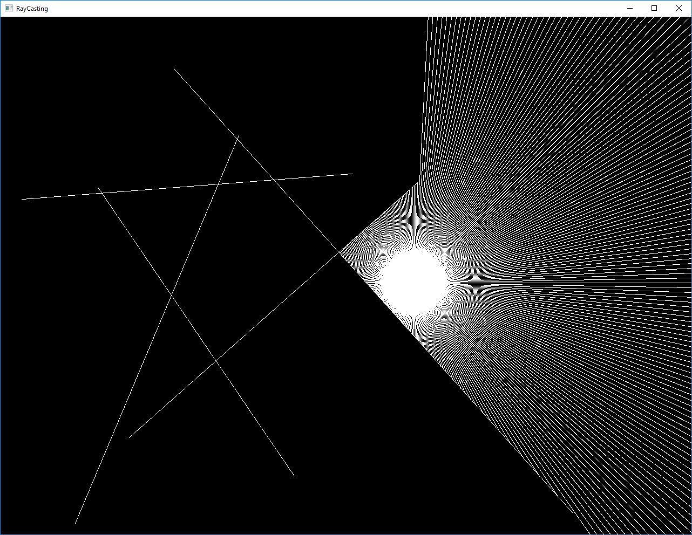
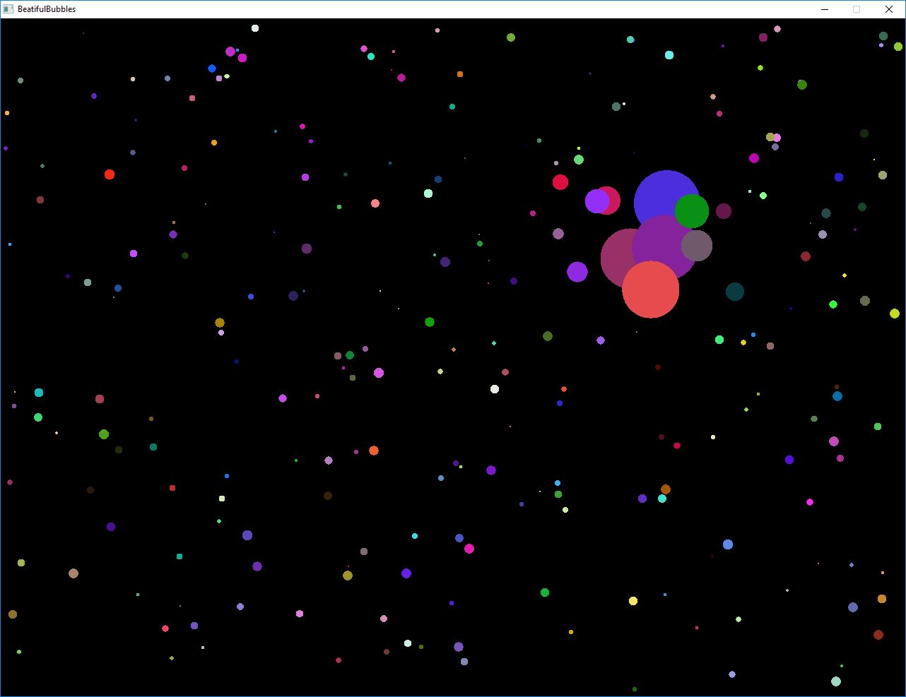

# CreativeCoding
This is a repository for some small scale coding, just for fun.

# Project

|ID|Name|Finish Date|Language|Library|
|---|-----|-----|-------|------|
|0001|RayCasting|2019-08-23|C++|SFML|
|0002|BeatifulBubbles|2019-08-23|C++|SFML|

# Screenshot
### 0001. RayCasting

### 0002. BeatifulBubbles

# Description

This is just for fun, and the functionality is the first target while the performance is not.

This project will be updated as soon as I finish a new one with any language and any libraries.

